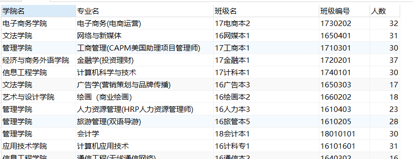
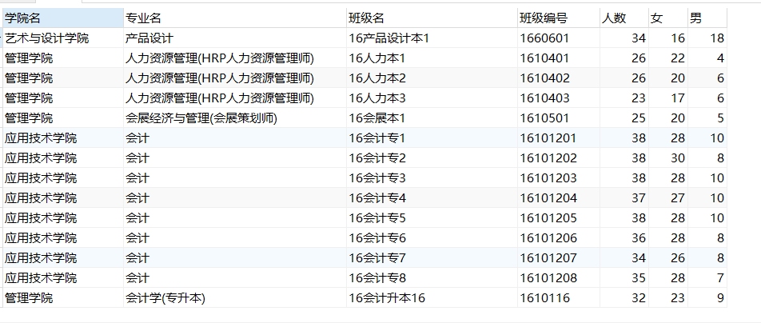

首先统计各班级人数，学生表一条数据代表一个学生，  
已经知道学生表有“管理院系，专业，班级名称，班级代码，年级，性别”等信息，
要统计的是在校学生，所以用where条件限定年级在2016~2019。  
然后使用`group by`指定学生班级，在`count(*)`列就能统计出各班人数

```sql
SELECT 管理院系 AS 学院名, 专业 AS 专业名, 班级名称 AS 班级名, 班级代码 AS 班级编号
    , COUNT(*) AS 人数
FROM EAMS_STUDENT_ALL_INFO
WHERE (年级 = 2016
    OR 年级 = 2017
    OR 年级 = 2018
    OR 年级 = 2019)
GROUP BY 管理院系, 专业, 班级代码, 班级名称
```



统计各班男女人数比较难，最开始准备用`LEFT JOIN`。用学生表为基础，左连接算出男生人数的学生表，再左连接算出女生人数的学生表，  
但是这样做有点麻烦，效率和准确性都不高，所以最后选择了sum函数计算出男女人数方法

```sql
SELECT 管理院系 AS 学院名, 专业 AS 专业名, 班级名称 AS 班级名, 班级代码 AS 班级编号
    , COUNT(*) AS 人数,
    SUM(CASE
        WHEN 性别 = '女' THEN 1
        ELSE 0
    END) AS 女,
    SUM(CASE
        WHEN 性别 = '男' THEN 1
        ELSE 0
    END) AS 男
FROM EAMS_STUDENT_ALL_INFO a
WHERE (年级 = 2016
    OR 年级 = 2017
    OR 年级 = 2018
    OR 年级 = 2019)
GROUP BY 管理院系, 专业, 班级代码, 班级名称
ORDER BY 班级名称
```

结果很准确

