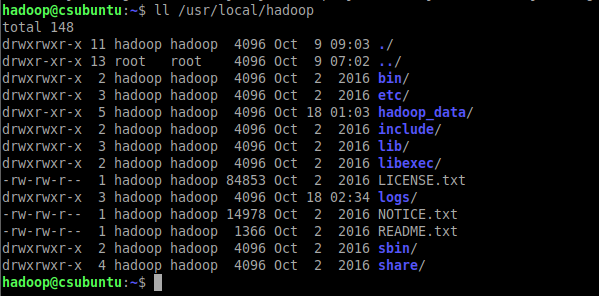
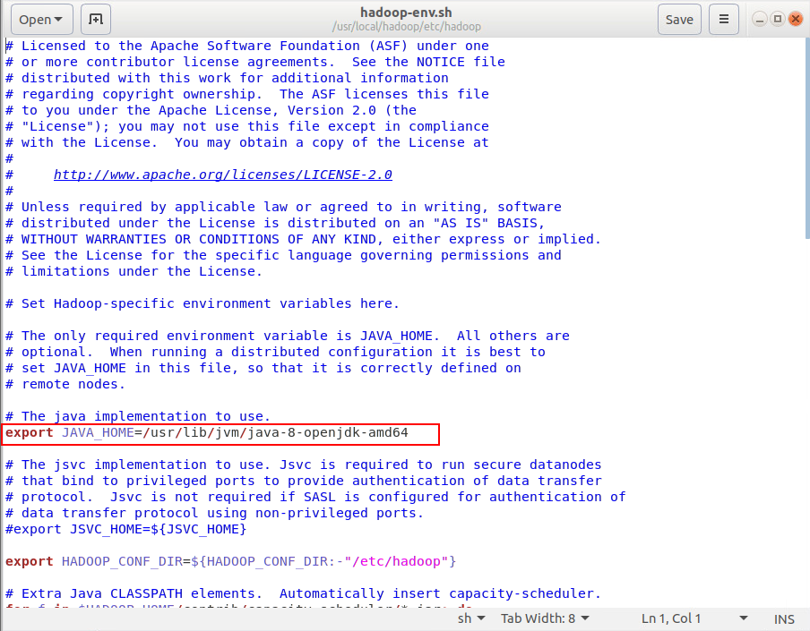
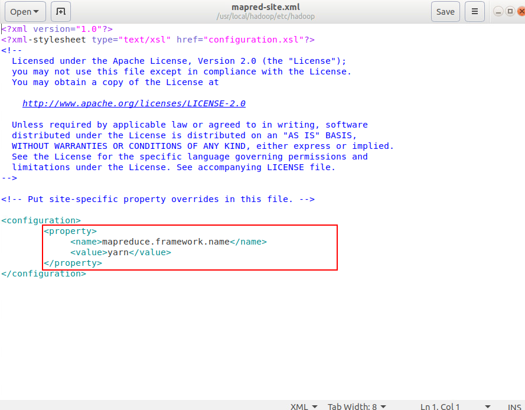
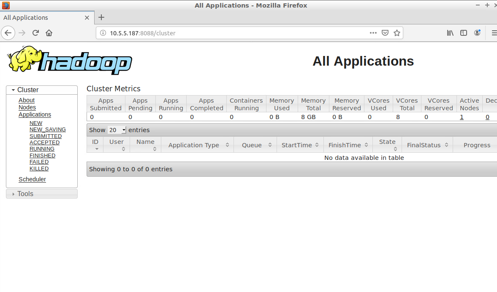
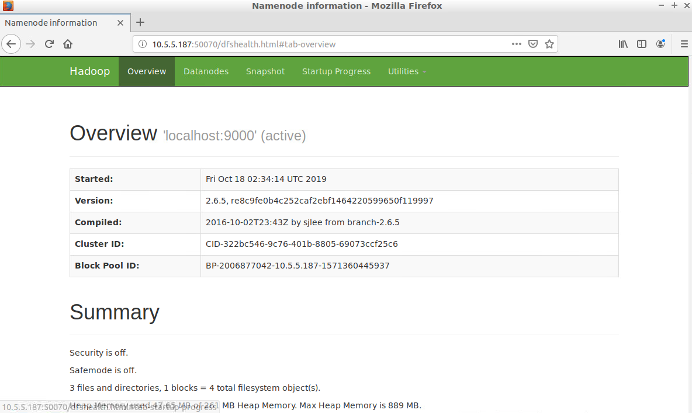
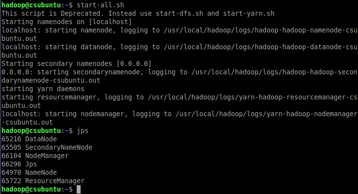

Hadoop被公认是一套行业大数据标准开源软件，在分布式环境下提供了海量数据的处理能力。单节点集群是利用一台主机模拟Hadoop运行环境，可以使用Hadoop所有模块


<!-- more -->
## 一、准备

### 1.1创建Hadoop用户

在操作过程中，ubuntu系统和centos系统不同的执行的命令我都做了说明，没有说明的命令则两种系统都能执行

> ubuntu命令
```bash
sudo useradd -m hadoop -s /bin/bash     # 创建hadoop用户，并使用/bin/bash作为shell
sudo passwd hadoop                      # 为hadoop用户设置密码，之后需要连续输入两次密码
sudo adduser hadoop sudo                # 为hadoop用户增加管理员权限
su - hadoop                             # 切换当前用户为用户hadoop
sudo apt-get update                     # 更新软件包信息
```

> centos命令
```bash
sudo useradd -m hadoop -s /bin/bash     # 创建hadoop用户，并使用/bin/bash作为shell
sudo passwd hadoop                      # 设置密码
sudo visudo                             # 设置管理员，找到root ALL=(ALL) ALL这行，在下面增加一行hadoop ALL=(ALL) ALL
su - hadoop                             # 切换当前用户为用户hadoop
```

### 1.2设置SSH无密码登录

> ubuntu命令
```bash
sudo apt-get install openssh-server     # 安装SSH server
ssh localhost                           # 登陆SSH，第一次登陆输入yes
exit                                    # 退出登录的ssh localhost
cd ~/.ssh/                              # 如果没法进入该目录，执行一次ssh localhost
ssh-keygen -t rsa                       # 产生秘钥进行后续身份验证，需三次回车确认
cat ./id_rsa.pub >> ./authorized_keys   # 将产生的Key放到许可证文件中
ssh localhost                           # 此时已不需密码即可登录localhost
```

> centos命令
```shell
rpm -qa | grep ssh                      # 查看ssh是否安装，如果包含了SSH client跟SSH server，则不需要再安装
sudo yum install openssh-clients        # 安装ssh
sudo yum install openssh-server
ssh localhost                           # 登陆SSH，输入yes,然后按提示输入hadoop密码
exit                                    # 退出刚才的 ssh localhost
cd ~/.ssh/                              # 若没有该目录，请先执行一次ssh localhost
ssh-keygen -t rsa                       # 会有提示，都按回车就可以
cat id_rsa.pub >> authorized_keys       # 加入授权
chmod 600 ./authorized_keys             # 修改文件权限
```

## 二、安装JDK

> ubuntu命令
```bash
java -version                           # 查看当前java版本，未出现版本信息代表未安装
sudo apt-get install default-jdk        # 使用apt-get安装openJDK
java -version                           # 再次查询Java版本，查看是否安装成功
```

查询java安装路径路径，记住该路径，下面步骤中的配置要用到

```bash
update-alternatives --display java
```


> centos命令
安装openJDK
```
yum install java-1.8.0-openjdk.x86_64 java-1.8.0-openjdk-devel.x86_64
```

jdk路径
```
/usr/lib/jvm/java-1.8.0-openjdk
```

## 三、下载安装Hadoop

> ubuntu命令
```
apt-get install wget
```

> centos命令
```
yum -y install wget
```

下载安装hadoop
```bash
wget http://archive.apache.org/dist/hadoop/core/hadoop-2.6.4/hadoop-2.6.5.tar.gz     # 下载hadoop
sudo tar -zxvf hadoop-2.6.5.tar.gz      # 解压缩
sudo mv hadoop-2.6.5 /usr/local/hadoop  # 将hadoop移动到/usr/local/hadoop
ll  /usr/local/hadoop                   # 查看hadoop安装目录
```



* bin是运行文件目录，包括Hadoop、HDFS和YARN
* sbin是shell文件目录，包括start-all.sh、stop-all.sh
* etc/hadoop目录包含hadoop配置文件
* lib是hadoop函数库目录
* logs系统日志目录

## 四、设置Hadoop环境变量

在终端输入命令打开编辑器
使用vim编辑器，点击键盘"i", 就能开始编辑。输入配置文件内容后，点击键盘"esc"键，然后输入`:wq`来保存退出

> ubuntu命令
```bash
sudo vim --version                      # 检查是否安装vim
sudo apt-get install vim                # 安装vim
sudo vim ~/.bashrc                      # 编辑.bashrc
```

> centos命令
```bash
sudo rpm -qa|grep vim                   # 检查是否安装vim
sudo yum install vim -y                 # 安装vim
sudo vim ~/.bashrc                      # 编辑.bashrc
```

在编辑器中输入下面内容

```python
# 设置jdk安装路径，参考安装jdk的部分输出的路径
export JAVA_HOME=/usr/lib/jvm/java-8-openjdk-amd64
# centos的jdk路径，使用cento时取消下面注释
# export JAVA_HOME=/usr/lib/jvm/java-1.8.0-openjdk
# 设置HADOOP_HOME为安装路径
export HADOOP_HOME=/usr/local/hadoop
# 设置PATH
export PATH=$PATH:$HADOOP_HOME/bin
export PATH=$PATH:$HADOOP_HOME/sbin
# 其他环境变量
export CLASSPATH=$($HADOOP_HOME/bin/hadoop classpath):$CLASSPATH
export HADOOP_MAPRED_HOME=$HADOOP_HOME
export HADOOP_COMMON_HOME=$HADOOP_HOME
export HADOOP_HDFS_HOME=$HADOOP_HOME
export YARN_HOME=$HADOOP_HOME
# 连接库相关设置
export HADOOP_COMMON_LIB_NATIVE_DIR=$HADOOP_HOME/lib/native
export HADOOP_OPTS="-DJava.library.path=$HADOOP_HOME/lib"
export JAVA_LIBRARY_PATH=$HADOOP_HOME/lib/native:$JAVA_LIBRARY_PATH
```

或者图形界面可以使用`sudo gedit ~/.bashrc`命令编辑，在编辑器中输入后，然后按ctrl+s保存，再关闭编辑器


让设置立即生效

```bash
source ~/.bashrc
```


## 五、修改Hadoop配置文件

编辑hadoop-env.sh

```bash
sudo vim /usr/local/hadoop/etc/hadoop/hadoop-env.sh
```

设置JAVA_HOME的路径，参考安装jdk的部分输出的路径，编辑完成保存退出


修改core-site.xml文件

```bash
sudo vim /usr/local/hadoop/etc/hadoop/core-site.xml
```

输入以下内容

```xml
<configuration>
        <property>
             <name>hadoop.tmp.dir</name>
             <value>file:/usr/local/hadoop/hadoop_data</value>
             <description>Abase for other temporary directories.</description>
        </property>
        <property>
             <name>fs.default.name</name>
             <value>hdfs://localhost:9000</value>
        </property>
</configuration>
```

第一个节点是临时目录，第二个节点是HDFS默认名称


编辑yarn-site.xml

```bash
sudo vim /usr/local/hadoop/etc/hadoop/yarn-site.xml
```

输入以下内容

```xml
<configuration>
<!-- Site specific YARN configuration properties -->
        <property>
             <name>yarn.nodemanager.aux-services</name>
             <value>mapreduce_shuffle</value>
        </property>
        <property>
             <name>yarn.nodemanager.aux-services.mapreduce.shuffle.class</name>
             <value>org.apache.hadoop.mapred.ShuffleHandler</value>
        </property>
</configuration>
```


编辑mapred-site.xml，mapred-site.xml用于监控Map与Reduce程序的JobTracker任务分配情况以及TaskTracker任务运行情况

```bash
sudo cp /usr/local/hadoop/etc/hadoop/mapred-site.xml.template /usr/local/hadoop/etc/hadoop/mapred-site.xml    #复制模板文件
sudo vim /usr/local/hadoop/etc/hadoop/mapred-site.xml
```

输入以下内容

```xml
<configuration>
        <property>
             <name>mapreduce.framework.name</name>
             <value>yarn</value>
        </property>
</configuration>
```

这个节点是设置mapreduce框架为yarn


编辑 hdfs-site.xml

```bash
sudo vim /usr/local/hadoop/etc/hadoop/hdfs-site.xml
```

输入下面内容

```xml
<configuration>
  <property>
     <name>dfs.replication</name>
     <value>1</value>
  </property>
  <property>
     <name>dfs.namenode.name.dir</name>
     <value>file:/usr/local/hadoop/hadoop_data/hdfs/namenode</value>
  </property>
  <property>
     <name>dfs.datanode.data.dir</name>
     <value>file:/usr/local/hadoop/hadoop_data/hdfs/datanode</value>
  </property>
</configuration>
```

第一个节点是设置blocks副本备份数量，第二个是NameNode数据存储目录，第三个是DataNode数据存储目录


## 六、创建并格式化HDFS目录

```bash
sudo mkdir -p /usr/local/hadoop/hadoop_data/hdfs/namenode   #创建namenode数据存储目录
sudo mkdir -p /usr/local/hadoop/hadoop_data/hdfs/datanode   #创建datanode数据存储目录
sudo chown -R hadoop /usr/local/hadoop                      #修改Hadoop目录所有者为hadoop
hadoop namenode -format                                     #格式化HDFS
```

## 七、启动Hadoop

```bash
start-dfs.sh                       #启动HDFS
start-yarn.sh                      #启动Hadoop MapReduce框架Yarn
```

或者同时启动

```bash
start-all.sh
```

输入`jps`查看进程是否启动


查看Hadoop ResourceManager Web页面，打开浏览器输入 <http://localhost:8088/>


查看NameNode HDFS Web页面，打开浏览器输入 <http://localhost:50070/>


## 八、搭建hadoop集群

Hadoop 的运行方式是由配置文件决定的（运行 Hadoop 时会读取配置文件），因此如果需要从伪分布式模式切换回分布式模式，需要修改配置文件，先按照上面一二三四步骤搭建环境，再进行下面的步骤

准备四台计算机，其中有一台namenode和三台datanode

### 8.1 配置第一台datanode服务器

先把ip改成固定ip
> ubuntu改ip命令
```bash
sudo vim /etc/network/interfaces                #改ip,
sudo /etc/init.d/networking restart             #重启网卡
```

> centos改ip命令
```bash
vim /etc/sysconfig/network-scripts/ifcfg-ens192 #改ip,
service network restart                         #重启网卡
```

修改主机名为data1
```bash
sudo vim /etc/hostname
```

编辑hosts文件，每台ip对应一个主机
```bash
sudo vim /etc/hosts
```

编辑core-site.xml
```bash
sudo vim /usr/local/hadoop/etc/hadoop/core-site.xml
```
输入以下内容
```xml
<configuration>
        <property>
             <name>fs.default.name</name>
             <value>hdfs://master:9000</value>
        </property>
</configuration>
```

编辑yarn-site.xml
```
vim /usr/local/hadoop/etc/hadoop/yarn-site.xml
```

输入下面内容
```xml
<configuration>
<!-- Site specific YARN configuration properties -->
        <property>
                <name>yarn.nodemanager.aux-services</name>
                <value>mapreduce_shuffle</value>
        </property>
        <property>
                <name>yarn.nodemanager.aux-services.mapreduce.shuffle.class</name>
                <value>org.apache.hadoop.mapred.ShuffleHandler</value>
        </property>
        <property>
                <name>yarn.resourcemanager.resource-tracker.address</name>
                <value>master:8025</value>
        </property>
        <property>
                <name>yarn.resourcemanager.scheduler.address</name>
                <value>master:8030</value>
        </property>
        <property>
                <name>yarn.resourcemanager.address</name>
                <value>master:8050</value>
        </property>
</configuration>
```

以上设置说明：

* ResourceManager主机与NodeManager的连接地址为8025
* ResourceManager与ApplicationMater的连接地址为8030
* ResourceManager与客户端的连接地址为8050

编辑mapred-site.xml
```
vim /usr/local/hadoop/etc/hadoop/mapred-site.xml
```
输入下面内容
```xml
<configuration>
        <property>
                <name>mapred.job.tracker</name>
                <value>master:54311</value>
        </property>
</configuration>
```

编辑hdfs-site.xml
```
vim /usr/local/hadoop/etc/hadoop/hdfs-site.xml
```
输入下面内容,设置datanode目录
```xml
<configuration>
  <property>
     <name>dfs.replication</name>
     <value>3</value>
  </property>
  <property>
     <name>dfs.datanode.data.dir</name>
     <value>file:/usr/local/hadoop/hadoop_data/hdfs/datanode</value>
  </property>
</configuration>
```

重复以上步骤再建立3台主机，如果是VM虚拟机则复制3台虚拟机

### 8.2 配置第二台datanode服务器

先把ip改成固定ip
> ubuntu改ip命令
```bash
sudo vim /etc/network/interfaces                #改ip,
sudo /etc/init.d/networking restart             #重启网卡
```

> centos改ip命令
```bash
vim /etc/sysconfig/network-scripts/ifcfg-ens192 #改ip,
service network restart                         #重启网卡
```

改主机名为data2
```bash
sudo vim /etc/hostname
```

### 8.3 配置第三台datanode服务器

先把ip改成固定ip
> ubuntu改ip命令
```bash
sudo vim /etc/network/interfaces                #改ip,
sudo /etc/init.d/networking restart             #重启网卡
```

> centos改ip命令
```bash
vim /etc/sysconfig/network-scripts/ifcfg-ens192 #改ip,
service network restart                         #重启网卡
```

改主机名为data3
```bash
sudo vim /etc/hostname
```

### 8.4 配置一台namenode服务器

先把ip改成固定ip
> ubuntu改ip命令
```bash
sudo vim /etc/network/interfaces                #改ip,
sudo /etc/init.d/networking restart             #重启网卡
```

> centos改ip命令
```bash
vim /etc/sysconfig/network-scripts/ifcfg-ens192 #改ip,
service network restart                         #重启网卡
```

改主机名为master
```bash
sudo vim /etc/hostname
```

编辑hdfs-site.xml
```
vim /usr/local/hadoop/etc/hadoop/hdfs-site.xml
```
输入下面内容,设置datanode目录
```xml
<configuration>
  <property>
     <name>dfs.replication</name>
     <value>3</value>
  </property>
  <property>
     <name>dfs.namenode.name.dir</name>
     <value>file:/usr/local/hadoop/hadoop_data/hdfs/namenode</value>
  </property>
</configuration>
```

编辑masters文件,主要是告诉hadoop哪一台服务器是namenode
```
sudo vim /usr/local/hadoop/etc/hadoop/masters   # 设置master
```

编辑slaves文件,主要是告诉hadoop哪一台服务器是datanode
```
sudo vim /usr/local/hadoop/etc/hadoop/slaves    #设置data1,data2,data3
```

手动重启所有服务器

### 8.5 mater连接data1、data2、data3，创建HDFS目录

使用master主机连接data1进行配置
```bash
ssh data1                                               # ssh连接到data1
sudo rm -rf /usr/local/hadoop/hadoop_data/hdfs          # 删除HDFS所有目录
mkdir -p /usr/local/hadoop/hadoop_data/hdfs/datanode    # 创建DataNode存储目录
sudo chown -R hadoop:hadoop /usr/local/hadoop           # 更改目录所有者
exit                                                    # 中断连接回到master
```

使用master主机连接data2进行配置
```bash
ssh data2                                               # ssh连接到data1
sudo rm -rf /usr/local/hadoop/hadoop_data/hdfs          # 删除HDFS所有目录
mkdir -p /usr/local/hadoop/hadoop_data/hdfs/datanode    # 创建DataNode存储目录
sudo chown -R hadoop:hadoop /usr/local/hadoop           # 更改目录所有者
exit                                                    # 中断连接回到master
```

使用master主机连接data3进行配置
```bash
ssh data3                                               # ssh连接到data1
sudo rm -rf /usr/local/hadoop/hadoop_data/hdfs          # 删除HDFS所有目录
mkdir -p /usr/local/hadoop/hadoop_data/hdfs/datanode    # 创建DataNode存储目录
sudo chown -R hadoop:hadoop /usr/local/hadoop           # 更改目录所有者
exit                                                    # 中断连接回到master
```

创建并格式化namenode HDFS目录
```bash
su - hadoop                                             # 切换hadoop用户
sudo rm -rf /usr/local/hadoop/hadoop_data/hdfs          # 删除HDFS所有目录
mkdir -p /usr/local/hadoop/hadoop_data/hdfs/namenode    # 创建DataNode存储目录
sudo chown -R hadoop:hadoop /usr/local/hadoop           # 更改目录所有者
hadoop namenode -format                                 # 格式化namenode HDFS目录
```

### 8.6 启动集群

```bash
start-dfs.sh                       # 启动HDFS，第一次会询问，输入yes
start-yarn.sh                      # 启动Hadoop MapReduce框架Yarn
```

或者同时启动

```bash
start-all.sh
```

如果要停止可以用
```bash
stop-all.sh
```

查看master启动的进程
```bash
jsp
```


查看data1启动的进程
```bash
ssh data1                       # ssh连接data1
jps                             # 查看data1的进程
exit                            # 退出连接
```


### 8.7 端口开放说明

集群启动后由于存在防火墙，所以hadoop无法访问，可以按需开放以下端口。或者直接关闭，一劳永逸

| 组件      | 节点              | 默认端口 | 配置                                                                             | 用途说明                                                         |
| --------- | ----------------- | -------- | -------------------------------------------------------------------------------- | ---------------------------------------------------------------- |
| HDFS      | DataNode          | 50010    | dfs.datanode.address                                                             | datanode服务端口，用于数据传输                                   |
| HDFS      | DataNode          | 50075    | dfs.datanode.http.address                                                        | http服务的端口                                                   |
| HDFS      | DataNode          | 50475    | dfs.datanode.https.address                                                       | https服务的端口                                                  |
| HDFS      | DataNode          | 50020    | dfs.datanode.ipc.address                                                         | ipc服务的端口                                                    |
| HDFS      | NameNode          | 50070    | dfs.namenode.http-address                                                        | http服务的端口                                                   |
| HDFS      | NameNode          | 50470    | dfs.namenode.https-address                                                       | https服务的端口                                                  |
| HDFS      | NameNode          | 8020     | fs.defaultFS                                                                     | 接收Client连接的RPC端口，用于获取文件系统metadata信息。          |
| HDFS      | journalnode       | 8485     | dfs.journalnode.rpc-address                                                      | RPC服务                                                          |
| HDFS      | journalnode       | 8480     | dfs.journalnode.http-address                                                     | HTTP服务                                                         |
| HDFS      | ZKFC              | 8019     | dfs.ha.zkfc.port                                                                 | ZooKeeper FailoverController，用于NN HA                          |
| YARN      | ResourceManager   | 8032     | yarn.resourcemanager.address                                                     | RM的applications manager(ASM)端口                                |
| YARN      | ResourceManager   | 8030     | yarn.resourcemanager.scheduler.address                                           | scheduler组件的IPC端口                                           |
| YARN      | ResourceManager   | 8031     | yarn.resourcemanager.resource-tracker.address                                    | IPC                                                              |
| YARN      | ResourceManager   | 8033     | yarn.resourcemanager.admin.address                                               | IPC                                                              |
| YARN      | ResourceManager   | 8088     | yarn.resourcemanager.webapp.address                                              | http服务端口                                                     |
| YARN      | NodeManager       | 8040     | yarn.nodemanager.localizer.address                                               | localizer IPC                                                    |
| YARN      | NodeManager       | 8042     | yarn.nodemanager.webapp.address                                                  | http服务端口                                                     |
| YARN      | NodeManager       | 8041     | yarn.nodemanager.address                                                         | NM中container manager的端口                                      |
| YARN      | JobHistory Server | 10020    | mapreduce.jobhistory.address                                                     | IPC                                                              |
| YARN      | JobHistory Server | 19888    | mapreduce.jobhistory.webapp.address                                              | http服务端口                                                     |
| HBase     | Master            | 60000    | hbase.master.port                                                                | IPC                                                              |
| HBase     | Master            | 60010    | hbase.master.info.port                                                           | http服务端口                                                     |
| HBase     | RegionServer      | 60020    | hbase.regionserver.port                                                          | IPC                                                              |
| HBase     | RegionServer      | 60030    | hbase.regionserver.info.port                                                     | http服务端口                                                     |
| HBase     | HQuorumPeer       | 2181     | hbase.zookeeper.property.clientPort                                              | HBase-managed ZK mode，使用独立的ZooKeeper集群则不会启用该端口。 |
| HBase     | HQuorumPeer       | 2888     | hbase.zookeeper.peerport                                                         | HBase-managed ZK mode，使用独立的ZooKeeper集群则不会启用该端口。 |
| HBase     | HQuorumPeer       | 3888     | hbase.zookeeper.leaderport                                                       | HBase-managed ZK mode，使用独立的ZooKeeper集群则不会启用该端口。 |
| Hive      | Metastore         | 9083     | /etc/default/hive-metastore中export PORT=<port>来更新默认端口                    |
| Hive      | HiveServer        | 10000    | /etc/hive/conf/hive-env.sh中export HIVE_SERVER2_THRIFT_PORT=<port>来更新默认端口 |
| ZooKeeper | Server            | 2181     | /etc/zookeeper/conf/zoo.cfg中clientPort=<port>                                   | 对客户端提供服务的端口                                           |
| ZooKeeper | Server            | 2888     | /etc/zookeeper/conf/zoo.cfg中server.x=[hostname]:nnnnn[:nnnnn]，标蓝部分         | follower用来连接到leader，只在leader上监听该端口。               |
| ZooKeeper | Server            | 3888     | /etc/zookeeper/conf/zoo.cfg中server.x=[hostname]:nnnnn[:nnnnn]，标蓝部分         | 用于leader选举的。只在electionAlg是1,2或3(默认)时需要。          |

例如开放8025端口
```
sudo firewall-cmd --zone=public --permanent --add-port=8025/tcp
```

其他防火墙命令
```bash
sudo firewall-cmd --state                       # 运行状态
sudo firewall-cmd --list-all                    # 查看防火墙规则
sudo firewall-cmd --zone=public --list-ports    # 已经开放的端口
sudo systemctl stop firewalld.service           # 停止防火墙
sudo systemctl start firewalld.service          # 运行防火墙
sudo systemctl restart firewalld.service        # 重启防火墙
sudo firewall-cmd --zone=public --remove-port=5672/tcp --permanent  # 关闭5672端口
netstat -lnpt # 查看监听的端口
netstat -lnpt | grep 5672 # 查看端口被哪个进程占用
```

## 九、Hadoop常用的HDFS命令
| 命令                     | 说明                                    |
| ------------------------ | --------------------------------------- |
| hadoop fs -mkdir         | 创建HDFS目录                            |
| hadoop fs -ls            | 列出HDFS目录                            |
| hadoop fs -copyFromLocal | 使用copyFromLocal复制本地文件到HDFS     |
| hadoop fs -put           | 使用put复制本地文件到HDFS               |
| hadoop fs -cat           | 列出HDFS目录下的文件内容                |
| hadoop fs -copyToLocal   | 使用copyToLocal将HDFS上的文件复制到本地 |
| hadoop fs -cp            | 复制HDFS文件                            |
| hadoop fs -rm            | 删除HDFS文件                            |

操作示例
```bash
hadoop fs -mkdir -p /usr/hadoop/test            # 创建/usr/hadoop/test目录
hadoop fs -copyFromLocal /home/hadoop/data.txt /usr/hadoop/test/test.txt # 复制本地文件到hdfs目录
hadoop fs -cat /home/hadoop/data.txt|more       # 查看文件内容，如果内容较大|more是分页显示
hadoop fs -put /home/hadoop/data.txt /usr/hadoop/test/test.txt # put可以直接覆盖文件，copyFromLocal则需要-f命令
# put和copyFromLocal的区别是put可以接受标准输入
echo abc | hadoop fs -put - /usr/hadoop/test/test.txt   # 输入abc到hdfs文件内容
ls /home/hadoop | hadoop fs -put - /usr/hadoop/test/hadooplist.txt   # 将本地目录列表存储到hdfs文件
hadoop fs -copyToLocal /usr/hadoop/test/hadooplist.txt  # 复制hdfs文件到本地
hadoop fs -get /usr/hadoop/test/hadooplist.txt local.txt        # 使用get复制hdfs文件到本地
hadoop fs -cp /usr/hadoop/test/hadooplist.txt /usr/hadoop       # 复制hdfs文件到其他目录
hadoop fs -rm /usr/hadoop/test/hadooplist.txt           # 删除hdfs文件
hadoop fs -rm -R /usr/hadoop/test                       # 删除hdfs目录
hadoop fs -ls -R /                                      # 查看所有hdfs目录,-R表示子目录也要看
```

## 十、遇到的问题和解决办法

在安装完成后发现namenode进程没有启动，打不开 <http://localhost:50070/> 页面。首先去查看日志

```bash
cd /usr/local/hadoop/logs               #进入日志目录
sz hadoop-hadoop-namenode-csubuntu.log  #下载日志
```


发现是9000端口被占用

```bash
sudo netstat -lnp | grep 9000           #查看9000端口占用
```


看到是nginx占用了9000端口,把nginx停止就能重新启动hadoop

```bash
ps -ef | grep nginx                     #查看nginx主进程
sudo kill -9 主进程号                   #强制停止Nginx
```


启动hadoop守护进程

