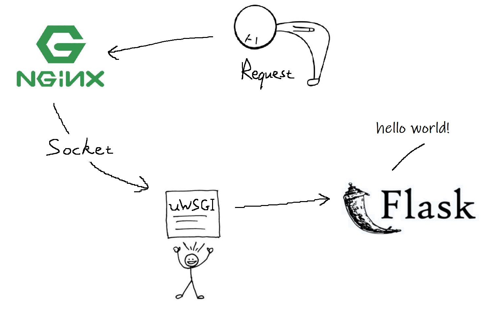

uWSGI是一个Web服务器，它实现了WSGI协议、uwsgi、http等协议。


<!-- more -->
## 一、准备
更新apt源
```bash
sudo apt-get update
```

安装pip
```bash
sudo apt-get install python3-pip
```

创建项目文件夹，克隆自己的项目到服务器
```bash
sudo mkdir /var/www
cd /var/www
git clone http://** # 这里输入自己的项目地址
```

## 二、安装postsql
安装postsql9.5版本，如果是安装最新版本，则不需要写版本号。安装成功后，会自动添加一个名为postgres的系统用户，密码随机。并自动生成一个名为postgres的数据库
```bash
sudo apt-get install postgresql-9.5
sudo apt-get install python-psycopg2
sudo apt-get install libpq-dev
```

打开客户端工具（psql）修改postgres数据库用户的密码
```bash
sudo -u postgres psql # 使用postgres用户登录数据库
```
```bash
# 以下内容内容都是在 postgres=# 下输入
ALTER USER postgres WITH PASSWORD 'postgres'; # 密码设置为123455，有分号才会执行命令
\q #退出客户端
```

修改ubuntu操作系统的postgres用户的密码
```bash
su root # 切换到root用户
sudo passwd -d postgres #清空用户postgres的密码
sudo -u postgres passwd #设置密码 接下来按要求输入两次密码，要与上面的密码相同
```

修改PostgresSQL数据库配置实现远程访问
```bash
# 打开配置文件，修改以下内容
vim /etc/postgresql/9.5/main/postgresql.conf
# 监听任何地址访问，修改连接权限
#listen_addresses = 'localhost' 改为 listen_addresses = '*'
# 启用密码验证
#password_encryption = on 改为 password_encryption = on

# 打开配置文件，增加以下内容，配置可访问的用户ip段
vim /etc/postgresql/9.5/main/pg_hba.conf
# 在文档末尾加上以下内容
host all all 0.0.0.0 0.0.0.0 md5

# 重启PostgreSQL数据库
/etc/init.d/postgresql restart

# 配置5432端口的防火墙设置
iptables -A INPUT -p tcp -m state --state NEW -m tcp --dport 5432 -j ACCEPT
```

## 三、安装配置nginx
为什么有了uWSGI为什么还需要nginx？因为nginx具备优秀的静态内容处理能力，然后将动态内容转发给uWSGI服务器，这样可以达到很好的客户端响应。

安装nginx
```bash
sudo apt-get install nginx
```

mynginx.conf是需要自己创建的一个nginx配置文件，此文件放在项目文件夹中，配置内容如下
```nginx
server {
    listen       9000;
    server_name 203.176.71.157 localhost;

    access_log /var/www/iclinicAI/logs/access.log;
    error_log /var/www/iclinicAI/logs/error.log;

    location / {
        include uwsgi_params;
        # 端口号自行设定
        uwsgi_pass 127.0.0.1:8004;
        uwsgi_param UWSGI_CHDIR /var/www/iclinicAI;
        uwsgi_param UWSGI_SCRIPT manage:app; 
        uwsgi_read_timeout 300;
    }
}
```

刚建立的配置文件使用符号链接到Nginx配置文件文件夹中
```bash
sudo ln -s /var/www/iclinicAI/mynginx.conf /etc/nginx/conf.d/
sudo /etc/init.d/nginx restart # 重启nginx
```

## 四、配置uwsgi
ubuntu安装uwsgi
```bash
sudo apt-get install uwsgi
```
或者直接用pip安装
```
pip install uwsgi
```
建立uwsgi配置文件，此文件放在项目文件夹中，配置内容如下
```ini
[uwsgi]
#http=127.0.0.1:8001
# uwsgi 启动时所使用的地址与端口

socket = 127.0.0.1:8004 # 端口和nginx配置中的一致，可以使用其他端口
# 指向网站目录
chdir = /var/www/iclinicAI
module = manage

# python 启动程序文件
wsgi-file = manage.py 

# python 程序内用以启动的 application 变量名
callable = app 

# 处理器数
processes = 4

# 线程数
threads = 2

#状态检测地址
stats = 127.0.0.1:9191   # 使用flask项目默认的端口，可以换但必须是flask运行时使用的端口

# 添加它，使uwsgi后台运行
daemonize =/var/www/iclinicAI/logs/uwsgi.log
```
```bash
uwsgi --ini uwsgi.ini 启动
# 使用 killall -9 uwsgi 关闭
```

## 五、使用supervisor守护进程

首先安装supervisor
```bash
sudo apt-get install supervisor
```

生成默认配置文件
```bash
echo_supervisord_config > /root/supervisord.conf
```

加入监控程序的配置
```config
[program:project_name]          # project_name这里写上你的项目名称，如我的为[project:chihu]
command = uwsgi --ini /var/www/iclinicAI/uwsgi.ini  # 跟手动启动的命令一样
stopsignal=QUIT
autostart=true
autorestart=true
stdout_logfile=/var/www/iclinicAI/logs/supervisor_chihu.log      # 运行日志
stderr_logfile=/var/www/iclinicAI/logs/supervisor_chihu_err.log  # 错误日志
```

启动supervisord
```bash
supervisorctl -c /root/supervisord.conf
supervisorctl -c /root/supervisord.conf status # 查看状态
#update!!!(如果supervisord.conf里项目有修改敲个命令update一下)
```

检查uwsgi进程是否正常运行
```bash
ps aux|grep uwsgi
```

